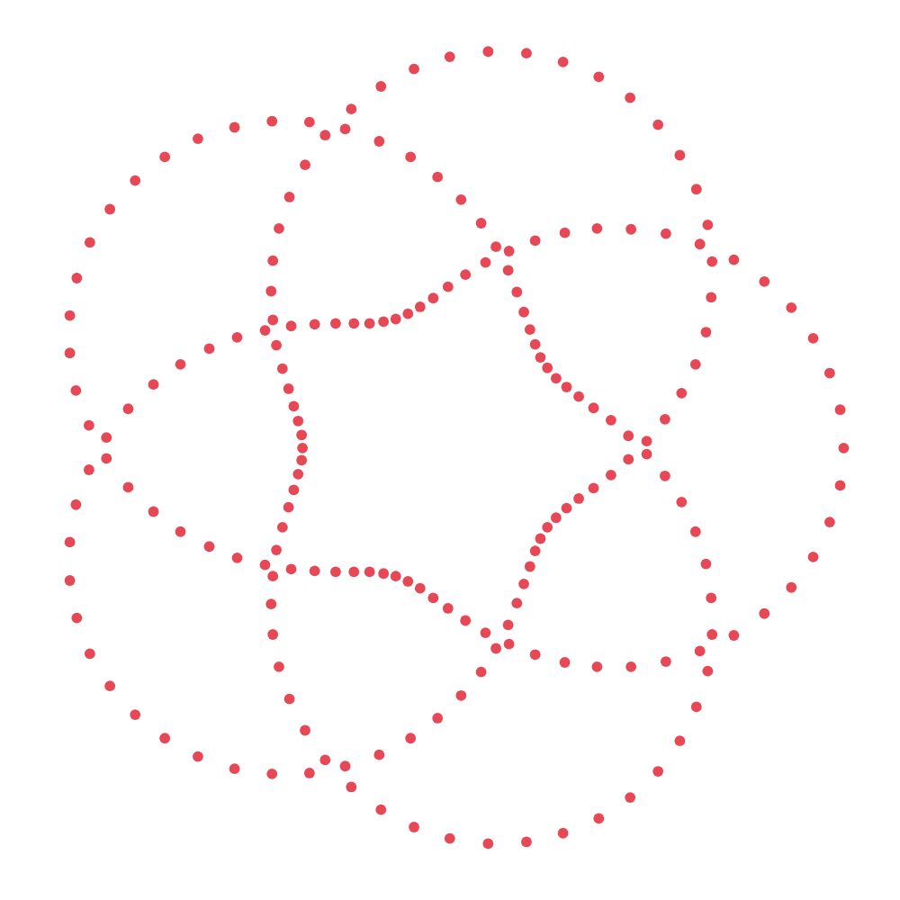

# we are twist labs

we combine a decade of software development experience with agents to benefit from the best parts of both.

we don't call it ai for the same reason you don't call a power drill ai. we use the best tool for the job. sometimes that's a screwdriver.

say hello. see what happens.
